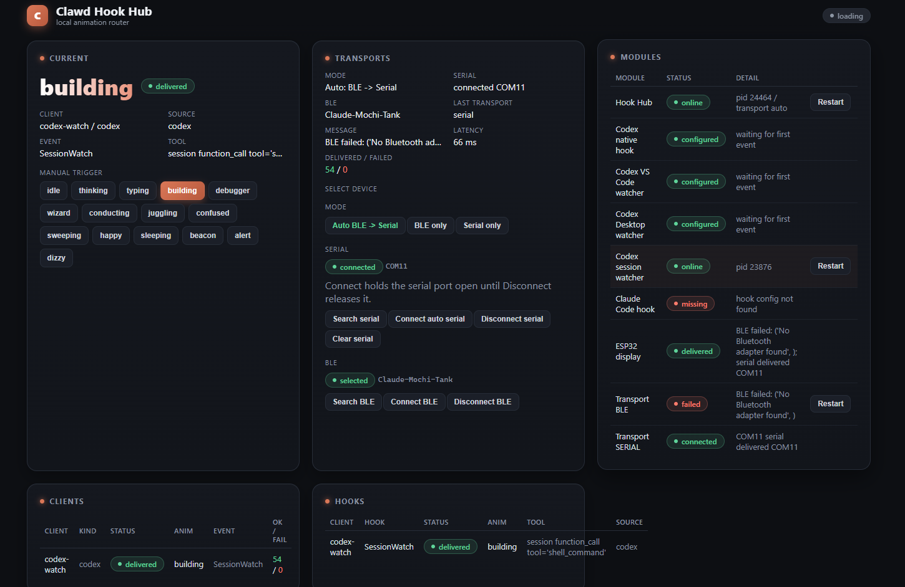
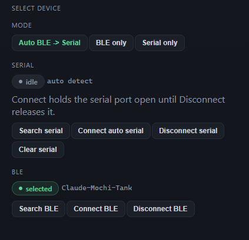
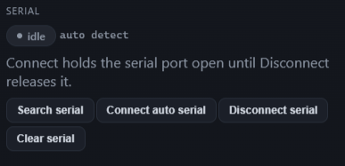
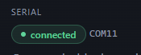
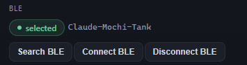

# 红绿灯 & MINIC 桌宠使用手册

<span style="color:red;font-weight:bold;">本产品为个人设计、手工制作开发实验板，不在3C强制认证产品目录，无3C认证，严禁当作家用电器、工控成品全天候连续通电使用。  使用限制：仅限电子爱好者个人学习、项目调试研发，禁止商用量产、24小时不间断插电、无人看管带电运行；
安全约定：闲置时必须拔掉电源断电；因产品原生硬件缺陷（元器件虚焊故障），可协商质保；超出使用规范、违规长时间通电 / 私自改电源导致烧坏、起火等全部损失由使用人自行承担。
拍下使用即代表已完整阅读、知悉全部使用风险并自愿遵守使用规则。</span>

---

## 产品简介

本产品可将 AI 编程助手（Codex / Claude Code）的工作状态实时显示到 ESP32 小设备上：

- **红绿灯版**：三颗 LED 指示灯，基于 ESP32-C3 SuperMini
- **MINIC 桌宠版**：240×240 彩色 ST7789 屏幕，基于普通 ESP32-C3 SuperMini

工作原理：电脑上的 **Hook Hub** 接收 AI 助手的工作状态，通过 USB 串口或蓝牙发送给 ESP32 设备，设备播放对应动画或灯效。

```text
Codex / Claude Code
  → 本机 Hook / Session Watcher
  → Hook Hub（http://127.0.0.1:8765）
  → USB 串口 / BLE
  → ESP32 设备
```

---

## 快速开始

### 第一步：安装 Hook Skill

Hook Skill 是连接 AI 助手与 Hub 的桥梁，目前原生支持：

- Codex（桌面版）
- Codex（VS Code 插件）
- Claude Code（VS Code 插件）

**项目已开源：**

●Codex：https://github.com/GFlash6/codex-status-LED 

●Claude Code：https://github.com/GFlash6/claude-status-led 


**安装方式**

在对应 AI 助手中新建对话，输入以下提示词即可自动完成安装：

**Codex：**
```text
帮我安装并配置 https://github.com/GFlash6/codex-status-LED 这个 skill，并启动
```
**Claude Code：**
```text
帮我安装并配置https://github.com/GFlash6/claude-status-led 这个 skill，并启动
```
**适配其他 AI 助手**

其他 AI 助手（Copilot、Cursor、Trae 等）可参照上述仓库结构自行配置，提示词参考：
```text
拉取 https://github.com/GFlash6/codex-status-LED 到本地，并参照它的结构为我的 [助手名称] 配置文档配置相关 hook 
```


### 第二步：启动 Hook Hub

安装完 Skill 后，打开浏览器访问：

```text
http://127.0.0.1:8765
```

Hub 界面如下，它负责转发 Hook 收到的状态信息并发送给设备：



**确认 Session Watcher 在线：**


若显示离线，点击旁边的刷新按钮即可重新连接：


---

### 第三步：连接设备

> **设备连接方式说明：**
> 
> - 红绿灯版：仅支持 **USB 串口**连接
> - MINIC 桌宠版：支持 **USB 串口** 和 **蓝牙（BLE）** 两种模式

#### USB 串口连接（两款设备通用）

1. 使用数据线（非仅充电线）将设备连接到电脑
2. 打开 Hub 界面，确认中间面板 MODE 设置：
   
   
   
3. 串口连接区域：
   
   
4. **先点击 `Clear Serial` 按钮**，清除旧的串口状态：
   
   
5. 等待约 1 秒后，点击连接按钮：
   
   
6. 等待约 2 秒，显示 `connect` 即为连接成功：
   
   

#### 蓝牙（BLE）连接（仅 MINIC 桌宠）



点击蓝牙连接按钮即可：


---

### 第四步：验证连接

连接成功后，可使用 Hub 左侧的**手动控制按钮**测试：

- 点击 `happy` → 设备进入**全亮**状态（任务完成效果）
- 点击 `sleep` → 设备进入**全灭**状态（休眠效果）

如果灯效/动画按预期变化，说明连接正常，可以正常使用了。

---

## LED 状态说明

| 状态 | 红绿灯表现 | 触发条件 |
| --- | --- | --- |
| 未连接 | 快速流水灯 | 设备未与 Hub 连接 |
| 工作中 | 中速流水灯 | AI 助手正在执行任务 |
| 任务完成 | 全部常亮 | AI 助手完成任务 |
| 空闲 | 全部熄灭 | AI 助手空闲等待 |

---

## 完整状态列表

| 状态名 | 含义 |
| --- | --- |
| `beacon` | 等待连接或等待新状态 |
| `idle` | 空闲 |
| `typing` | 正在输入/编辑 |
| `thinking` | 思考中 |
| `building` | 正在构建或运行命令 |
| `debugger` | 调试/检查 |
| `wizard` | 网络请求、图片生成等特殊操作 |
| `confused` | 等待确认或需要注意 |
| `alert` | 提醒 |
| `happy` | 任务完成 |
| `sleeping` | 休眠动画 |
| `dizzy` | 出现错误 |
| `disconnected` | 连接断开 |

---

## 常见问题排查

**设备无反应？按以下顺序检查：**

1. 数据线是否支持数据传输（非仅充电线）
2. 设备固件是否已正确刷入
3. 串口监视器是否能看到启动日志
4. Hub 页面 `http://127.0.0.1:8765` 是否能正常打开
5. Hub 页面是否有收到事件记录
6. 若串口被 PlatformIO Serial Monitor 占用，Hub 将无法同时使用串口发送数据，请先关闭 Serial Monitor

**无法连接蓝牙？**
红绿灯目前无法连接蓝牙，不过具备蓝牙功能，可自行使用minic固件修改适配，开启蓝牙后芯片会发热严重
桌宠蓝牙默认开启，在无蓝牙连接10min后会默认关闭蓝牙以降低发热，重新插拔即可开启

**连接后状态不更新？**

- 确认 Session Watcher 在线（见第二步）
- 检查 Hook Skill 是否安装并运行正常
- 在对应 AI 助手中执行一个任务，观察 Hub 页面是否收到事件

---

*更多技术细节请参阅 [README.md](README.md)*
交流群:


